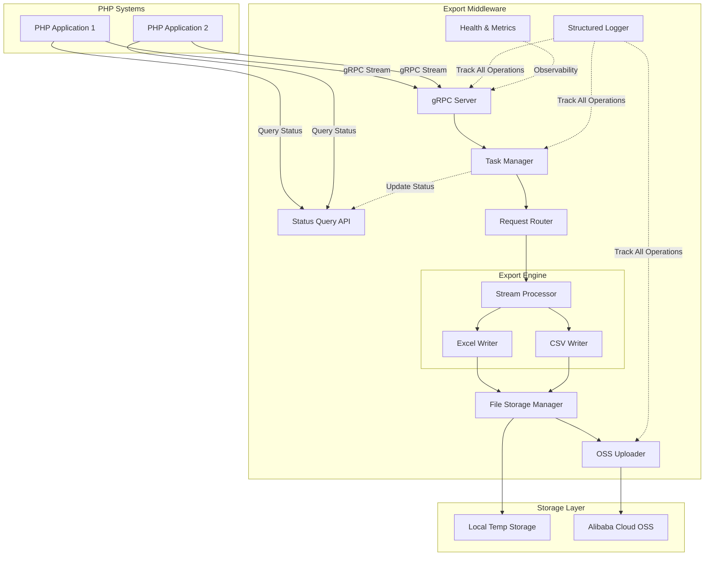
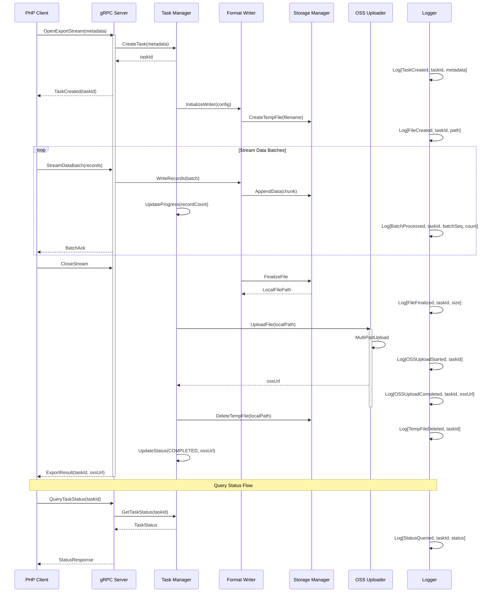

# Data Export Middleware Design

## Overview

This document defines the design for a high-performance data export middleware service that enables PHP systems to offload resource-intensive Excel and CSV generation tasks. The middleware leverages Golang's efficiency and gRPC streaming to handle large-scale data exports (hundreds of thousands of records) with optimized memory usage and processing speed.

### Business Context

Current PHP-based export functionality suffers from:
- Slow processing for large datasets (100k+ records)
- High memory consumption leading to potential OOM errors
- Poor scalability for data-intensive operations

### Solution Approach

A dedicated Golang service that:
- Receives data via gRPC streaming for minimal memory footprint
- Generates Excel/CSV files efficiently using streaming writes
- Uploads generated files to Alibaba Cloud OSS
- Returns OSS download links to calling systems
- Supports concurrent export tasks with status tracking
- Provides comprehensive logging for troubleshooting

## System Architecture

### High-Level Component View

### Core Components

| Component | Responsibility | Extensibility Point |
|-----------|---------------|---------------------|
| gRPC Server | Accept streaming connections, handle authentication | Protocol extension, rate limiting |
| Status Query API | Provide task status and progress information | Query filters, pagination |
| Task Manager | Coordinate concurrent export tasks and track states | Task scheduling, priority queues |
| Request Router | Route requests to appropriate writer based on format | New format handlers registration |
| Stream Processor | Coordinate data reception and writing pipeline | Transformation plugins, filtering |
| Excel Writer | Generate Excel files with streaming write | Style templates, formula support |
| CSV Writer | Generate CSV files with proper encoding | Custom delimiters, encoding options |
| File Storage Manager | Handle local temporary file operations | Storage optimization, cleanup policies |
| OSS Uploader | Upload files to Alibaba Cloud OSS | Multi-part upload, retry logic |
| Structured Logger | Comprehensive logging with context and tracing | Log shipping, alert integration |
| Health & Metrics | Service monitoring and performance tracking | Custom metrics, alerting hooks |

## Functional Design

### Core Use Cases

#### UC1: Async Export with Concurrent Tasks

**Actor**: PHP Application  
**Precondition**: Valid authentication credentials  
**Flow**:
1. PHP client initiates gRPC streaming connection
2. Client sends export metadata (columns, format options)
3. Middleware creates task and returns task ID immediately
4. Client streams data records in batches
5. Middleware writes records to file incrementally (concurrent with other tasks)
6. Upon stream completion, middleware finalizes file
7. Middleware uploads file to Alibaba Cloud OSS
8. Middleware updates task status with OSS URL
9. Middleware cleans up local temporary file

**Postcondition**: File uploaded to OSS, task marked as completed with OSS URL

#### UC2: Query Export Task Status

**Actor**: PHP Application  
**Precondition**: Task ID from previous export request  
**Flow**:
1. Client sends status query request with task ID
2. Middleware retrieves task information from task manager
3. Middleware returns detailed status information

**Response Information**:
- Task state (QUEUED, PROCESSING, UPLOADING, COMPLETED, FAILED)
- Progress percentage (records processed / total expected)
- OSS download URL (if completed)
- Error details with context (if failed)
- Processing timestamps (start time, completion time)

**Postcondition**: Client receives current task status and can take appropriate action

### Process Flow

## Data Model Design

### gRPC Service Contracts

#### Export Request Metadata

| Field | Type | Description | Required |
|-------|------|-------------|----------|
| requestId | string | Unique identifier for tracking | Yes |
| format | enum | EXCEL or CSV | Yes |
| filename | string | Desired output filename | Yes |
| columns | ColumnDefinition[] | Column headers and metadata | Yes |
| options | FormatOptions | Format-specific configuration | No |

#### Column Definition

| Field | Type | Description | Required |
|-------|------|-------------|----------|
| name | string | Column header text | Yes |
| dataType | enum | STRING, NUMBER, DATE, BOOLEAN | Yes |
| width | int32 | Column width hint | No |
| format | string | Display format (e.g., date pattern) | No |

#### Format Options

| Field | Type | Description | Applicable To |
|-------|------|-------------|---------------|
| csvDelimiter | string | Field separator | CSV |
| csvEncoding | string | Character encoding | CSV |
| excelSheetName | string | Worksheet name | Excel |
| excelStartRow | int32 | Starting row for data | Excel |
| compressionEnabled | bool | Enable file compression | Both |

#### Data Record Batch

| Field | Type | Description | Required |
|-------|------|-------------|----------|
| records | Record[] | Array of data records | Yes |
| batchSequence | int64 | Sequence number for ordering | Yes |

#### Record

| Field | Type | Description | Required |
|-------|------|-------------|----------|
| values | string[] | Ordered field values matching columns | Yes |

#### Export Result

| Field | Type | Description |
|-------|------|-------------|
| taskId | string | Unique task identifier |
| status | enum | QUEUED, PROCESSING, UPLOADING, COMPLETED, FAILED |
| ossUrl | string | Alibaba Cloud OSS download URL (if completed) |
| fileSizeBytes | int64 | Generated file size |
| recordCount | int64 | Total records written |
| progressPercent | float | Processing progress (0-100) |
| checksumSHA256 | string | File integrity hash |
| errorMessage | string | Error details if failed |
| errorCode | string | Error classification code |
| startTime | timestamp | Task initiation time |
| completionTime | timestamp | Task completion time (if finished) |

#### Task Status Query Request

| Field | Type | Description | Required |
|-------|------|-------------|----------|
| taskId | string | Task identifier to query | Yes |

#### Task Status Query Response

| Field | Type | Description |
|-------|------|-------------|
| taskId | string | Task identifier |
| status | enum | Current task state |
| format | enum | EXCEL or CSV |
| filename | string | Target filename |
| recordsProcessed | int64 | Number of records processed so far |
| progressPercent | float | Completion percentage |
| ossUrl | string | Download URL (if completed) |
| fileSizeBytes | int64 | File size (if completed) |
| errorMessage | string | Detailed error message (if failed) |
| errorCode | string | Error code for programmatic handling |
| startTime | timestamp | When task started |
| completionTime | timestamp | When task finished (if applicable) |
| estimatedTimeRemaining | int64 | Seconds until completion (estimated) |

### Internal Data Structures

#### Export Session

Represents an active export operation in memory:

| Attribute | Purpose |
|-----------|---------|
| taskId | Unique task identifier |
| sessionId | Unique session identifier for internal tracking |
| writer | Active format writer instance |
| metadata | Request metadata snapshot |
| statistics | Real-time metrics (rows processed, bytes written, progress %) |
| startTime | Session initiation timestamp |
| lastUpdateTime | Last progress update timestamp |
| state | Current state (QUEUED, INITIALIZED, WRITING, FINALIZING, UPLOADING, COMPLETED, FAILED) |
| ossUrl | OSS download URL (populated after upload) |
| errorContext | Detailed error information if failed |
| concurrentTasks | Reference to other active tasks for resource management |

#### Writer Interface Contract

All format writers must implement:

| Method | Parameters | Returns | Purpose |
|--------|-----------|---------|---------|
| Initialize | metadata, outputPath | error | Prepare writer with configuration |
| WriteHeader | columns | error | Write column headers |
| WriteRecords | records[] | error | Append data records |
| Finalize | - | fileMetadata, error | Close file and return metadata |
| Cleanup | - | error | Release resources on error |

## Technical Strategy

### Concurrent Task Management Strategy

**Challenge**: Supporting multiple simultaneous export tasks without resource exhaustion

**Strategy**:
1. **Task Queue**: Implement bounded task queue with configurable concurrency limit
2. **Resource Isolation**: Each task maintains independent writer and buffer instances
3. **Progress Tracking**: Central task manager maintains state for all active and completed tasks
4. **Graceful Degradation**: When reaching concurrency limits, queue new tasks instead of rejecting

**Concurrency Control**:

| Aspect | Approach | Rationale |
|--------|----------|--------|
| Max Concurrent Tasks | Configurable (default: 10) | Balance throughput and resource usage |
| Task Queuing | FIFO queue with timeout | Fair processing order |
| Resource Per Task | Isolated buffers and file handles | Prevent interference |
| State Management | Thread-safe task registry | Support status queries |

### OSS Upload Strategy

**Challenge**: Efficiently upload large files to Alibaba Cloud OSS

**Strategy**:
1. **Multi-Part Upload**: Use OSS multi-part upload for files >100MB
2. **Retry Logic**: Exponential backoff for transient failures
3. **Parallel Parts**: Upload file chunks concurrently (configurable parallelism)
4. **Temporary Storage**: Keep local file until OSS upload confirms success
5. **Cleanup**: Delete local temporary files after successful upload

**Upload Configuration**:

| Parameter | Default | Purpose |
|-----------|---------|----------|
| partSize | 10MB | Size of each upload part |
| maxRetries | 3 | Upload retry attempts |
| parallelParts | 5 | Concurrent part uploads |
| uploadTimeout | 30min | Maximum upload duration |
| tempRetention | 1 hour | Keep temp file after upload (for recovery) |

**OSS URL Generation**:
- Generate signed URLs with configurable expiration (default: 7 days)
- Support both public and private bucket configurations
- Include file metadata in object tags for management

### Logging and Observability Strategy

**Challenge**: Comprehensive logging to diagnose issues across distributed operations

**Strategy**:
1. **Structured Logging**: Use structured log format (JSON) with consistent fields
2. **Context Propagation**: Include taskId, sessionId, and requestId in all log entries
3. **Log Levels**: Appropriate level usage (DEBUG, INFO, WARN, ERROR, FATAL)
4. **Correlation**: Link related operations through trace IDs
5. **Performance Metrics**: Log operation durations for bottleneck identification

**Log Categories and Contents**:

| Category | Log Events | Key Fields |
|----------|-----------|------------|
| Task Lifecycle | TaskCreated, TaskStarted, TaskCompleted, TaskFailed | taskId, format, filename, metadata |
| Data Processing | BatchReceived, BatchProcessed, RecordsWritten | taskId, batchSeq, recordCount, duration |
| File Operations | FileCreated, FileWritten, FileFinalized, FileClosed | taskId, filePath, fileSize, duration |
| OSS Operations | OSSUploadStarted, OSSPartUploaded, OSSUploadCompleted, OSSUploadFailed | taskId, ossUrl, fileSize, partNumber, duration |
| Resource Management | TempFileCreated, TempFileDeleted, MemorySnapshot | taskId, filePath, memoryUsage |
| Error Tracking | ValidationError, StreamError, WriteError, UploadError, SystemError | taskId, errorCode, errorMessage, stackTrace, context |
| Status Queries | StatusQueried, StatusNotFound | taskId, queriedBy, currentStatus |
| Concurrency | TaskQueued, TaskDequeued, ConcurrencyLimitReached | taskId, queueSize, activeTasks |

**Structured Log Format**:

Each log entry contains:
- timestamp: ISO8601 format with milliseconds
- level: Log level (DEBUG/INFO/WARN/ERROR/FATAL)
- taskId: Task identifier (if applicable)
- sessionId: Session identifier (if applicable)
- traceId: Distributed trace identifier
- component: Component name generating the log
- event: Event type from categories above
- message: Human-readable description
- fields: Additional context as key-value pairs
- duration: Operation duration in milliseconds (for performance events)
- error: Error details including code, message, and stack trace (for errors)

**Log Storage and Retention**:
- Write logs to stdout/stderr for container environments
- Support log rotation for file-based logging
- Recommended retention: 30 days for operational logs
- Archive error logs for extended period (90 days)

**Observability Integration**:
- Compatible with standard log aggregation tools (ELK, Loki, etc.)
- Support for distributed tracing (OpenTelemetry compatible)
- Expose metrics endpoint for Prometheus scraping
- Alert on error rate thresholds

### Memory Management Approach

**Challenge**: Handling hundreds of thousands of records without exhausting memory

**Strategy**:
1. **Streaming Reception**: Process gRPC stream chunks immediately without buffering entire dataset
2. **Bounded Buffers**: Maintain small fixed-size write buffers (configurable, default 10MB)
3. **Incremental Writing**: Write to disk as data arrives, not accumulating in memory
4. **Resource Cleanup**: Explicit cleanup of writer resources after each request

### File Generation Strategy

**Excel Generation**:
- Use streaming-capable Excel library that supports row-by-row writing
- Avoid in-memory workbook construction
- Write directly to file handles
- Support for basic styling without complex formulas (initial version)

**CSV Generation**:
- Direct buffered writer to file
- Handle proper escaping and quoting per RFC 4180
- Support configurable encodings (UTF-8 default, support for legacy encodings)

### Error Handling Philosophy

**Principles**:
1. **Early Validation**: Validate metadata before starting stream processing
2. **Partial Recovery**: If stream fails mid-process, clean up partially written files
3. **Client Notification**: Return detailed error context in response
4. **Observability**: Log all errors with request context for troubleshooting

**Error Categories**:

| Category | Handling Strategy | Client Impact | Logging |
|----------|------------------|---------------|----------|
| Validation Error | Reject immediately | Receive error before streaming data | ERROR with validation details |
| Stream Error | Abort session, cleanup resources | Receive error with partial progress info | ERROR with stream context |
| Write Error | Retry limited times, then fail | Receive error with diagnostic info | WARN on retry, ERROR on failure |
| Storage Error | Fail request, alert monitoring | Receive storage unavailable error | ERROR with storage details |
| OSS Upload Error | Retry with backoff, fail after max attempts | Receive upload failure with retry info | WARN on retry, ERROR on failure |
| Concurrency Limit | Queue task or reject if queue full | Task queued or rejected | INFO on queue, WARN on rejection |

### Extensibility Design

**Future Enhancement Points**:

1. **Format Writers**: Plugin architecture for new formats (JSON, Parquet, etc.)
   - Define abstract Writer interface
   - Support runtime registration of format handlers
   - Configuration-driven format selection

2. **Storage Backends**: Abstract storage layer supporting multiple destinations
   - Alibaba Cloud OSS (primary)
   - Local filesystem for testing
   - Other cloud providers (S3, GCS, Azure Blob) as future options

3. **Data Transformations**: Pipeline for record processing
   - Value formatting hooks
   - Data validation rules
   - Field masking/redaction

4. **Performance Optimization**:
   - Parallel processing for independent streams
   - Background compression
   - Caching for repeated exports

5. **Advanced Features**:
   - Template-based styling
   - Formula injection for Excel
   - Multi-sheet exports
   - Scheduled exports

### Configuration Strategy

**Configuration Categories**:

| Category | Parameters | Purpose |
|----------|-----------|---------|
| Server | port, statusPort, maxConnections, timeout | gRPC and status API tuning |
| Concurrency | maxConcurrentTasks, taskQueueSize, queueTimeout | Task concurrency control |
| Performance | bufferSize, maxBatchSize, writeTimeout | Resource limits |
| Storage | tempDirectory, tempRetention, cleanupEnabled | Temporary file management |
| OSS | endpoint, bucket, accessKey, secretKey, partSize, signedUrlExpiry | OSS configuration |
| Security | authEnabled, tlsEnabled, allowedClients | Access control |
| Logging | logLevel, logFormat, logOutput, enableTracing | Logging configuration |
| Monitoring | metricsPort, healthCheckInterval | Observability |

**Configuration Management**:
- Environment variable overrides
- Configuration file (YAML/JSON)
- Sensible defaults for all parameters

## Quality Assurance Strategy

### Testing Scope

**Core Components Requiring Test Coverage**:

1. **gRPC Service Layer**
   - Test streaming data reception
   - Test connection handling and timeouts
   - Test error propagation to clients
   - Test concurrent request handling
   - Test task creation and ID generation

2. **Task Manager**
   - Test task lifecycle management
   - Test concurrent task execution
   - Test task queuing and dequeuing
   - Test status query operations
   - Test task state transitions

3. **Format Writers**
   - Test Excel generation with various data types
   - Test CSV generation with edge cases (quotes, newlines, delimiters)
   - Test file integrity and readability
   - Test memory usage with large datasets

4. **Stream Processor**
   - Test batch processing logic
   - Test ordering preservation
   - Test error recovery mechanisms
   - Test resource cleanup

5. **Storage Manager**
   - Test temporary file creation and finalization
   - Test path handling and sanitization
   - Test disk space checks
   - Test file cleanup operations

6. **OSS Uploader**
   - Test multi-part upload logic
   - Test retry mechanism with failures
   - Test signed URL generation
   - Test cleanup after successful upload
   - Test error handling for OSS failures

7. **Logging System**
   - Test structured log format
   - Test context propagation across components
   - Test log level filtering
   - Test error logging with stack traces

### Testing Approach

#### Unit Testing

**Focus**: Individual component behavior in isolation

**Key Scenarios**:
- Writer interface implementations with mock data
- Validation logic for metadata and records
- Error handling in each component
- Configuration parsing and defaults

**Target Coverage**: >80% for core business logic

#### Integration Testing

**Focus**: Component interaction and data flow

**Key Scenarios**:
- End-to-end export flow with mock gRPC client
- Writer integration with actual file I/O
- Storage manager with temporary file system
- OSS uploader with mock OSS service
- Task manager with concurrent operations
- Status query during active export
- Error propagation across component boundaries
- Log context propagation through call chain

#### Performance Testing

**Focus**: Resource efficiency and scalability

**Key Scenarios**:
- Export 500k records, measure memory usage (target: <100MB peak)
- Export 800k records, measure completion time
- Concurrent exports, measure resource contention
- Large field values (10KB per field)

**Success Criteria**:
- Memory usage remains constant regardless of dataset size
- Processing speed >10k records/second for CSV, >5k records/second for Excel
- No memory leaks over extended operation
- Successfully handles 500k-800k record exports without degradation

#### Load Testing

**Focus**: Service behavior under expected workload

**Key Scenarios**:
- 10 concurrent export requests
- 20 concurrent export requests (stress test)
- Sequential exports over 1-hour period
- Mixed format requests (Excel and CSV)
- Status query load during active exports
- Task queue saturation scenarios

**Success Criteria**:
- All requests complete successfully
- Response time SLA maintained
- No resource exhaustion
- Proper task queuing under high load
- Status queries remain responsive

### Test Data Strategy

**Data Variations**:
- Small datasets (100 rows) for fast iteration
- Medium datasets (10k rows) for integration testing
- Large datasets (500k-800k rows) for performance testing
- Edge cases: empty strings, special characters, null values, very long text

## Deployment Considerations

### Service Deployment Model

**Recommended Approach**: Standalone service deployment

- Deploy as single binary with configuration
- Run as systemd service or containerized (Docker)
- Expose gRPC port (default: 9090)
- Expose status query API port (default: 9091)
- Expose metrics endpoint (default: 8080)

### Resource Requirements

**Initial Sizing**:

| Resource | Minimum | Recommended | Rationale |
|----------|---------|-------------|-----------|
| CPU | 2 cores | 4 cores | Moderate processing, some concurrency |
| Memory | 512MB | 2GB | Buffer space for multiple concurrent exports |
| Disk | 20GB | 100GB+ | Temporary file storage, depends on retention policy |
| Network | 100Mbps | 1Gbps | Streaming data transfer |

### Operational Monitoring

**Key Metrics to Track**:

| Metric | Type | Purpose |
|--------|------|---------|
| activeTasks | Gauge | Current concurrent tasks |
| queuedTasks | Gauge | Tasks waiting in queue |
| exportDuration | Histogram | Processing time distribution |
| uploadDuration | Histogram | OSS upload time distribution |
| recordsProcessed | Counter | Total throughput |
| exportErrors | Counter | Failure rate tracking |
| ossUploadErrors | Counter | OSS upload failures |
| statusQueryCount | Counter | Number of status queries |
| memoryUsage | Gauge | Resource utilization |
| diskUsage | Gauge | Storage capacity monitoring |

**Health Checks**:
- Liveness: Service process running
- Readiness: Can accept new export requests (not at max concurrency)
- Dependency: OSS service accessible

### Security Considerations

**Initial Security Measures**:

1. **Authentication**: Token-based authentication for gRPC clients
2. **Authorization**: Client identification and basic ACL
3. **Data Protection**: Support for TLS encryption in transit
4. **File Access**: Generated files isolated per client/request
5. **Input Validation**: Strict validation of all client inputs
6. **OSS Security**: Use IAM credentials with least privilege, secure credential storage
7. **Log Security**: Sanitize sensitive data in logs (credentials, PII)

**Future Enhancements**:
- mTLS for client certificate validation
- Data encryption at rest
- Audit logging of all export operations
- Rate limiting per client

## Implementation Roadmap

### Phase 1: Core Functionality

**Scope**: Minimal viable service

- gRPC server with streaming support
- Task manager with basic concurrency control
- Basic Excel writer (simple data types)
- CSV writer with standard features
- Local temporary file storage
- OSS uploader with multi-part upload
- Basic structured logging
- Status query API
- Basic error handling

**Success Criteria**: Can export 500k-800k records to Excel/CSV and upload to OSS successfully

### Phase 2: Production Hardening

**Scope**: Operational readiness

- Comprehensive error handling with retry logic
- Health checks and metrics
- Configuration management
- Complete logging with context propagation
- Distributed tracing support
- Authentication mechanism
- Task queue management
- Graceful shutdown

**Success Criteria**: Ready for production deployment with full observability

### Phase 3: Optimization & Enhancement

**Scope**: Performance and features

- Memory optimization and profiling
- Enhanced concurrency control
- Advanced Excel features (styling, formulas)
- Performance benchmarking and tuning
- Multi-cloud storage support
- Advanced task scheduling

**Success Criteria**: Handles 800k+ records efficiently with 20+ concurrent tasks

## Risks and Mitigation

| Risk | Impact | Probability | Mitigation Strategy |
|------|--------|-------------|---------------------|
| Excel library limitations | High | Medium | Evaluate multiple libraries early, have fallback plan |
| Memory leaks in long-running service | High | Medium | Comprehensive testing, profiling, resource monitoring |
| OSS upload failures | High | Medium | Robust retry logic, fallback to local storage, alerting |
| Concurrent task management complexity | Medium | Medium | Thorough testing, use proven concurrency patterns |
| Disk space exhaustion | Medium | Medium | Implement cleanup policies, disk monitoring, quotas |
| gRPC streaming complexity | Medium | Low | Use proven patterns, thorough integration testing |
| PHP client integration challenges | Medium | Medium | Provide clear documentation, example client code |
| Log volume overwhelming storage | Low | Medium | Implement log rotation, level filtering, sampling for high-volume events |

## Success Metrics

**Project Success Indicators**:

1. **Performance**: 10x faster than current PHP implementation for 500k-800k records
2. **Memory**: <100MB peak memory for any export size (up to 800k records)
3. **Reliability**: 99.9% success rate for export requests (including OSS upload)
4. **Concurrency**: Support 10+ concurrent export tasks without degradation
5. **Observability**: Complete logging coverage enabling issue diagnosis within 5 minutes
6. **Adoption**: At least 2 PHP systems integrated within first 3 months
7. **Maintainability**: Core logic test coverage >80%

## Appendix

### Terminology

| Term | Definition |
|------|------------|
| Task | A single export request with unique identifier and lifecycle |
| Export Session | Internal representation of an active export operation |
| Stream Batch | A chunk of records sent in one gRPC message |
| Format Writer | Component responsible for generating files in specific format |
| OSS | Alibaba Cloud Object Storage Service |
| Signed URL | Time-limited URL for secure file download from OSS |
| Multi-Part Upload | OSS upload strategy for large files split into parts |
| Task Queue | FIFO queue holding tasks waiting for processing |
| Structured Logging | JSON-formatted logs with consistent fields for parsing |
| Trace ID | Unique identifier linking related operations across components |

### References

- gRPC Streaming Best Practices
- RFC 4180: CSV Format Specification
- Excel OpenXML Format Specification
- Go Memory Management Patterns
- Alibaba Cloud OSS API Documentation
- OpenTelemetry Specification for Distributed Tracing